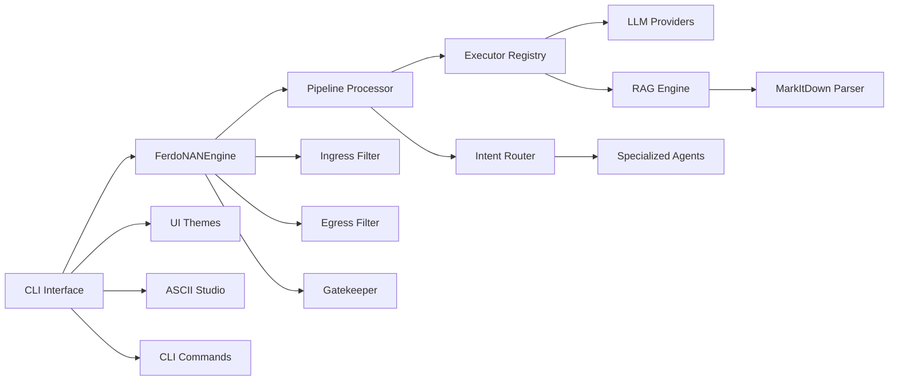

# FerdoNAN - Asistente Personal Multi-Agente con IA

**Versión:** 2.5.0 (Comandos slash, reestructuración de UI)  
**Estado:** Producción estable | **Arquitectura:** Hexagonal + Plugins

## Descripción General

FerdoNAN es un framework modular para asistentes de IA basado en agentes especializados, diseñado bajo principios de **bajo acoplamiento** y **alta cohesión**. Cada agente opera con su propio modelo de lenguaje, configuración de seguridad y capacidades, mientras que el núcleo (`core/`) proporciona servicios de orquestación, enrutamiento, ejecución y seguridad multicapa.

**Novedades v2.5.0:**
- Comandos slash (`/help`, `/exit`, `/agent list`, `/agent switch`, `/config show`, `/clear`)
- Reestructuración de UI: comandos reutilizables en `ui/cli_commands.py`
- Selector de agentes renombrado a `ui/agent_selector.py`
- Sistema de versionado SemVer (archivo `VERSION`)

## Arquitectura de Alto Nivel



## Estructura del Proyecto (v2.5.0)

```
ferdonan/
├── agents/                     # Agentes especializados
│   ├── narrador_dnd/           # Director de juego D&D
│   │   ├── resources/          # Recursos inmutables (libros, reglas)
│   │   ├── workspace/          # Datos dinámicos (personajes, inventarios)
│   │   ├── tools/              # Herramientas propias del agente
│   │   └── routes/             # Rutas YAML
│   ├── spotify_player/         # Control de Spotify
│   └── dev_assistant/          # Asistente de desarrollo
├── core/                       # Motor principal
│   ├── engine.py               # Estado e inicialización
│   ├── pipeline.py             # Pipeline de procesamiento
│   ├── factory.py              # Creación de componentes
│   ├── llm_factory.py          # Creación de clientes LLM
│   ├── interfaces.py           # Protocolos y ABCs
│   └── i18n/                   # Sistema de localización
├── security/                   # Firewalls y seguridad
│   ├── filters/                # Ingress, egress, semantic
│   ├── auth/                   # Gatekeeper, audit
│   └── rate_limiter.py
├── services/                   # Servicios core
│   ├── executor/               # Ejecutores (cognitive, script, stage_runner)
│   ├── router/                 # Enrutamiento (keyword, embedding, hybrid, LLM)
│   ├── sanitizer/              # Limpieza de inputs
│   ├── llm_providers/          # Ollama, Gemini, Groq, Local
│   └── rag/                    # RAG modular con MarkItDown
├── ui/                         # Interfaz de usuario
│   ├── agent_selector.py       # Selector de agentes
│   ├── cli_commands.py         # Comandos slash reutilizables
│   ├── console/                # Renderer con temas ANSI
│   ├── ascii/                  # Banners, boxes, tables, spinners
│   └── themes/                 # Temas YAML (refero, cyberpunk)
├── libs/                       # Biblioteca de recursos (ejemplos)
│   └── routes/                 # Rutas de ejemplo por versión
├── models/                     # Modelos de datos Pydantic
├── tests/                      # Pruebas unitarias (44+ tests)
├── locales/                    # Diccionarios i18n (en, es)
├── VERSION                     # Versión SemVer del proyecto
└── docs/                       # Documentación Sphinx
```

## Comandos CLI

| Comando | Descripción |
|---|---|
| `/help` | Muestra la ayuda |
| `/exit` o `/quit` | Sale del asistente |
| `/agent list` | Lista todos los agentes disponibles |
| `/agent switch <nombre>` | Cambia al agente especificado |
| `/config show` | Muestra la configuración actual |
| `/clear` | Limpia la pantalla |

También puedes escribir `salir`, `exit` o `quit` para salir.

## Características Principales

### Núcleo y Agentes
- Agentes especializados: Configuración vía YAML, rutas semánticas, memoria persistente
- Múltiples LLM: Ollama (local), Gemini (Google), Groq (LPU), Local (custom)
- Sistema de Stages: Encadenamiento de LLMs con diferentes proveedores

### RAG Avanzado (MarkItDown)
- Parsers inteligentes: Soporte para PDF, DOCX, XLSX, PPTX, HTML, imágenes (OCR), URLs
- Registro de parsers: Extensible vía decorador `@register_parser`

### UI y Experiencia de Usuario
- Temas visuales: YAML configurables (colores, badges, emojis)
- Comandos CLI: Sistema completo de comandos slash
- Historial persistente: Comandos guardados entre sesiones
- ASCII Studio: Banners, boxes decorativos, tablas, spinners

### Developer Assistant (Spec-Kit)
- GitHub integration: Listar repos, PRs, issues; crear PRs/issues
- Code review: Análisis de estilo, detección de TODOs/FIXMEs

### Seguridad
- Firewall multicapa: Ingress (regex), Egress (blacklist), Semántico (profanity)
- Gatekeeper: Aprobación humana con timeout
- Rate Limiting: Ventana deslizante por usuario

## Demo con Docker

```bash
git clone https://github.com/fyjjuk/FerdoNAN
cd FerdoNAN
docker-compose -f docker-compose.demo.yml up
# En otra terminal:
docker exec -it ferdonan-ollama ollama pull phi3:mini
docker exec -it ferdonan-ollama ollama pull llama3.2:3b
```

## Instalación Local

```bash
git clone https://github.com/fyjjuk/FerdoNAN
cd FerdoNAN
python -m venv venv
source venv/bin/activate
pip install -r requirements.txt
ollama serve  # En otra terminal
python main.py
```

## Tests Unitarios

```bash
pytest tests/ -v
```

## Extensibilidad

### Crear un nuevo agente

```bash
mkdir -p agents/mi_agente/{routes,tools,workspace,resources}
# Crear agents/mi_agente/config.yaml
# Crear agents/mi_agente/routes/mi_ruta.yaml
```

### Añadir un nuevo comando slash

Edita `ui/cli_commands.py` y añade tu comando en la función `process_slash_command()`.

## Documentación Técnica

```bash
cd docs/build/html
python -m http.server 8000
# Abrir http://localhost:8000
```

## Contribuciones

Ver `docs/source/contributing.md`

## Licencia

MIT

## Agradecimientos

- [Repomix](https://github.com/yamadashy/repomix) - Empaquetado de código para IA
- [ChromaDB](https://www.trychroma.com/) - Base de datos vectorial
- [MarkItDown](https://github.com/microsoft/markitdown) - Conversión de documentos
- [PyGithub](https://pygithub.readthedocs.io/) - API de GitHub
